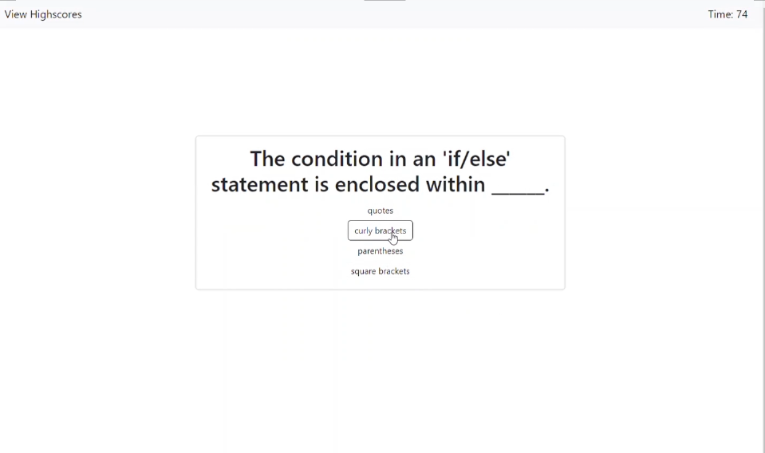

# 04 Web APIs: JS Code Quiz

## Description of Application

This application creates a JavaScipt code quiz. It starts with instructions and once the start button is clicked the timer starts. User has 75 seconds to answer all questions, they will lose 10 points for every incorrect answer. The quiz will end when time runs out or all the questions are answered. Once the game is over, user will be able to save their high score to the leaderboard with initials. They can click the view highscores link to see all high scores from their machine. 

## User Functionality
```
GIVEN I am taking a code quiz
WHEN I click the start button
THEN a timer starts and I am presented with a question
WHEN I answer a question
THEN I am presented with another question
WHEN I answer a question incorrectly
THEN time is subtracted from the clock
WHEN all questions are answered or the timer reaches 0
THEN the game is over
WHEN the game is over
THEN I can save my initials and score
```

## Live Link and Mock-Up

[JS Code Quiz Live Link](https://isayani.github.io/js-code-quiz/)

The following image shows the web application's appearance and functionality:



- - -
© 2022 ISayani Creative Services, Confidential and Proprietary. All Rights Reserved.
